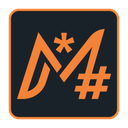

<div align="center">



# MiraMD

**A minimal, elegant Markdown editor — fast, lightweight, focused.**

[](https://github.com/axelclementfr/miramd/releases)
[](LICENSE)
[](https://tauri.app)
[](https://svelte.dev)

</div>

---

MiraMD is a desktop Markdown editor built from the ground up with Rust and Svelte 5, wrapped in [Tauri 2](https://tauri.app). It pairs the live-preview WYSIWYG experience of [MarkText](https://github.com/marktext/marktext) — whose [Muya](https://github.com/marktext/muya) engine powers MiraMD's editor — with a footprint and startup time you'd expect from a native app rather than an Electron one.

The name comes from Latin *mira* ("wonderful") + *MD* (Markdown).

## Highlights

- **Tiny binary, light memory** — ~5 MB binary, ~30 MB RAM at idle. No bundled Chromium.
- **True WYSIWYG Markdown** — powered by Muya. Switch to source mode anytime, or use a side-by-side split view.
- **Tabs, find-in-document, table of contents, recent files** — the comforts of a real editor, none of the bloat.
- **8 languages built-in** — French (default), English, Spanish, German, Italian, Portuguese, Japanese, Chinese.
- **6 themes** — Light, Dark, One Dark, Graphite, Material Dark, Ulysses.
- **Linux-first, cross-platform** — Linux (`.deb`, `.AppImage`), Windows (`.exe`, `.msi`), macOS (`.dmg`).

## Screenshots

<!-- TODO: add screenshots showing WYSIWYG mode, split view, themes -->

## Installation

Grab the binary for your platform from the [latest release](https://github.com/axelclementfr/miramd/releases).

### Linux

```bash
# Debian / Ubuntu
sudo dpkg -i MiraMD_*_amd64.deb

# Or use the portable AppImage
chmod +x MiraMD_*_amd64.AppImage
./MiraMD_*_amd64.AppImage
```

### Windows

Run the `MiraMD_*_x64-setup.exe` installer, or use the `.msi` package for system-wide deployment.

### macOS

Open `MiraMD_*_aarch64.dmg` (Apple Silicon). On first launch, right-click the app → **Open** to bypass Gatekeeper (the build is unsigned).

See [docs/installation.md](docs/installation.md) for detailed instructions and known issues per platform.

## Keyboard shortcuts

| Action | Shortcut |
|---|---|
| New tab | `Ctrl+N` |
| Open file | `Ctrl+O` |
| Save | `Ctrl+S` |
| Close tab | `Ctrl+W` |
| Find | `Ctrl+F` |
| Toggle sidebar | `Ctrl+B` |
| Settings | `Ctrl+,` |
| Headings 1–6 | `Ctrl+1`…`Ctrl+6` |

Full list in [docs/keybindings.md](docs/keybindings.md).

## Building from source

Prerequisites: Rust (stable), Node.js 20+, system WebKitGTK dependencies.

```bash
git clone https://github.com/axelclementfr/miramd.git
cd miramd
npm install
npm run tauri dev    # Hot-reload development
npm run tauri build  # Production build → src-tauri/target/release/bundle/
```

Detailed per-platform instructions in [docs/building.md](docs/building.md).

## Contributing

Bug reports, feature requests, and pull requests are welcome. Check the [contribution guide](docs/contributing.md) for the workflow and coding standards.

## Acknowledgements

MiraMD owes a great deal to **[MarkText](https://github.com/marktext/marktext)**:

- The **Muya** editor that powers MiraMD's WYSIWYG mode is MarkText's editor engine, used here as a pre-compiled dependency.
- The look, feel, and overall product concept were directly inspired by MarkText's pioneering design.

MarkText showed what a friendly, high-quality Markdown editor could look like. MiraMD is a rewrite in a different stack (Tauri + Svelte + Rust instead of Electron + Vue + JavaScript) to address performance and footprint concerns — but the original vision belongs to its authors. Huge thanks to the MarkText team.

## License

[MIT](LICENSE)
